 

<h2 align="center">▸ QUEST LOG ◂</h2>

🔒 &nbsp;<b>LOCKED QUEST</b> · Enterprise PeopleOps Core &nbsp;(HR & operations platform)

 

> *A guild of 400+ automated tests guards this fortress.*

- Full-cycle leave & policy engine, ledger and approval hierarchies
- Tamper-evident hash-chain audit log, field-level RBAC
- 401 test suites: Vitest unit/integration + Playwright E2E
- **Party:** React 19 · Express · MongoDB replica set + SCRAM · Vite · Zod

**REWARDS:** `+RBAC` `+AUDIT CHAIN` `+E2E DISCIPLINE`

🔒 &nbsp;<b>LOCKED QUEST</b> · Outbound AI Lead Engine &nbsp;(lead generation & outreach)

 

> *Speaks eight languages. Never sends twice.*

- 2-tier intent classification: deterministic multilingual regex + LLM fallback
- Cross-process session locking, multi-account quota balancing
- 138 hermetic tests, 68 % coverage
- **Party:** FastAPI · async SQLAlchemy · Alembic · Perplexity Sonar · Claude

**REWARDS:** `+INTENT CLASSIFIER` `+RATE LIMIT MASTERY`

🔒 &nbsp;<b>LOCKED QUEST</b> · Autonomous SDR Pipeline &nbsp;(LangGraph enrichment & drafting)

 

> *Two gates. A human holds both keys.*

- ICP qualification via Apollo, deep enrichment via Perplexity
- Two human-in-the-loop approval gates with LangGraph `interrupt()`
- Telegram bot interface with ACL, dual-scope export (sendable vs review)
- **Party:** LangGraph · PostgresSaver checkpoints · FastAPI · Telegram

**REWARDS:** `+HITL WORKFLOWS` `+GROUNDING EVALS`

🔒 &nbsp;<b>LOCKED QUEST</b> · VisualOps &nbsp;(local-first computer vision)

 

> *The cameras see. The video never leaves the building.*

- Turns CCTV feeds into structured physical events
- Zone presence, dwell time, business-rule violation engine
- Privacy-centric: raw video stays local, only events & snapshots leave
- **Party:** Python · RF-DETR · ByteTrack · Supervision · OpenCV · FastAPI

**REWARDS:** `+OBJECT TRACKING` `+EDGE DEPLOY`

🔒 &nbsp;<b>LOCKED QUEST</b> · 3D Elevator Configurator &nbsp;(real-time architectural web app)

 

> *Pick your walls, floor, lights and mirrors. Ride.*

- Interactive cabin customisation with PBR materials
- Dynamic Car Operating Panel with a working digital screen
- Instant state updates via Zustand
- **Party:** Next.js 14 · React Three Fiber · Three.js · Zustand · Tailwind

**REWARDS:** `+R3F` `+PBR SHADERS`

🔒 &nbsp;<b>LOCKED QUEST</b> · Atelier Studio &nbsp;(design-agency landing)

 

> *Warm tokens, custom type, no template in sight.*

- Turbopack, Base UI unstyled primitives, micro-interactions
- Responsive portfolio matrix and showcase cards
- **Party:** Next.js 16 · React 19 · Tailwind CSS v4 · Base UI

**REWARDS:** `+TYPOGRAPHY` `+MOTION`

 

 

<h2 align="center">▸ SAVE & CONTINUE ◂</h2>

**SLOT 1** &nbsp;·&nbsp; [github.com/TrebaDripat](https://github.com/TrebaDripat) &nbsp;·&nbsp; 📍 Ukraine 🇺🇦

Screens are hand-drawn SVG on the DMG palette. Character sheet and world map are rebuilt every night by <a href=".github/workflows/update-profile.yml">a GitHub Action</a>. Font: Press Start 2P (OFL).

